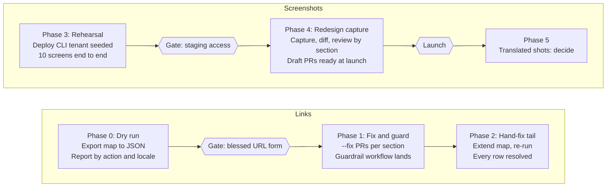

# Dashboard Redesign Docs Automation Plan

As of 2026-10-07 · Nick Gagliardi

## Summary

Two scripts and one Playwright project replace the manual find-and-fix job for the Dashboard redesign: a link rewriter that fans out across English, Japanese and French-Canadian MDX, and a manifest-driven screenshot capture pipeline with built-in pixel diffing. Everything runs locally on a clean fork; CI only guards against regressions. Target: link PRs merged before launch, screenshot PRs ready to merge at launch in mid-to-late October 2026.

What changed from the Sonnet draft, in order of impact:

- Localized MDX is in scope. `main/docs/ja-jp` and `main/docs/fr-ca` are full copies of the English tree and reference the same English image paths, so every rewrite touches three files, not one.
- The capture tool is Playwright Test, not shot-scraper or bare Playwright. `toHaveScreenshot()` gives the diff mode for free. shot-scraper would work for capture but has no diff.
- The demo tenant is seeded with Auth0 Deploy CLI YAML, not a custom Management API script.
- The manifest is keyed by target image, not by MDX row. 819 references collapse to a few hundred unique screens.
- The lookup map is nearly complete, not badly short. There are 143 distinct URL shapes in English MDX, and the top ten cover 55% of occurrences.
- Crop selectors are authored once, against the redesigned Dashboard. The pre-launch rehearsal covers ten screens, not all of them.
- Translated screenshots are a decision item, not a phase. The repo's existing practice is English screenshots under translated prose.

Repo constraint for the implementing agent: prepare branches and commits locally and hand them to the human to push. Never push, open or edit PRs on `auth0/docs-v2`, and omit AI attribution trailers in commits.

## Ground truth

All figures below were measured on `origin/main` at commit `ae3b25e93` (2026-10-07). The Sonnet draft's figures came from a local checkout 450 commits behind and should be discarded. The implementing agent should re-run the commands in the appendix on day one and update this table.

| Measure | Value |
| --- | --- |
| English MDX files under `main/docs` (excluding locales) | 3,385 |
| MDX files total including `ja-jp` and `fr-ca` | 9,307 |
| `manage.auth0.com` occurrences, English MDX | 1,296 in 641 files |
| `manage.auth0.com` occurrences, `ja-jp` / `fr-ca` MDX | 1,264 each |
| `manage.auth0.com` occurrences, `main/ai` MDX | 24 |
| Distinct URL shapes, English (ids and `{placeholders}` normalized) | 143 |
| Of which already use a `/dashboard/` form | 113 occurrences |
| Hash-route form `#/...` | 1,080 occurrences |
| Bare root `manage.auth0.com` or `manage.auth0.com/#` | 154 occurrences |
| Image files under `main/docs/images` | 2,047 |
| Image files in the Contentful dump `images/cdy7uua7fh8z` | 762 |
| English MDX image references (`` plus ``) | 987 + 224 |
| English image references into the dump | 806 in 529 files |
| Markdown image refs with empty alt text | 224 of 987 |
| `<Frame>` wrappers (plain / with caption) | 1,336 / 4 |
| Japanese MDX refs into `images/ja-jp` vs into shared English images | 33 vs 1,024 |

Structural facts the scripts depend on:

- Images are referenced as `/docs/images/...` in MDX and live at `main/docs/images/...` on disk. A few legacy refs use `/images/...` without the `/docs` prefix.
- The dominant screenshot pattern is `<Frame></Frame>`, sometimes split across three lines with indentation.
- A localized page has the same path under `main/docs/ja-jp/` and `main/docs/fr-ca/` and references the identical image path. Verified on `authenticate/custom-token-exchange/cte-attack-protection.mdx`.
- `scripts/` on main holds only `fetch-sdk-versions.py`. `localize-links.js` no longer exists. `package.json` runs `node --test "scripts/**.test.js"` and has no dependencies.
- `lychee.toml` excludes `^https://manage\.auth0\.com/` entirely, so no CI check touches dashboard links today.
- `.github/workflows/link-check.yml` runs on `pull_request` to `main` with `paths: ['**/*.mdx?']`, uses `tj-actions/changed-files` to scope the run, and posts a sticky PR comment. The guardrail workflow mirrors this.
- CODEOWNERS routes `/scripts`, `**/package.json` and `**/CLAUDE.md` to `@auth0/project-docs-management-codeowner`; `.github` and the locale trees need both that team and `@auth0/project-docs-writers-codeowner`.
- The repo already contains three competing "new" dashboard URL forms: `/dashboard/#/applications` (9 occurrences), `/dashboard/*/organizations/list` (4), and tenant-specific `/dashboard/us/dev-6endizjt/...` (about 25). Plus malformed ones: `#/applications%7D`, `?/authentication-profiles`, `#/emails.`, `/*/connections/enterprise/self-service-profiles`.
- The audit sheet is private (export returns HTTP 401). Its 2,833 link rows match neither the English count nor the three-locale total, so the script output is the count of record.

## Decisions to lock before coding

Four conventions get hardcoded into scripts and a CI check. Settle them at the DOCS-5635 meeting; none of the code below should start until the first two are answered.

| Decision | Options seen in the repo or brief | Recommendation | Owner |
| --- | --- | --- | --- |
| Blessed tenant-agnostic dashboard URL form | `/dashboard/#/path`, `/dashboard/*/path`, `/dashboard/{region}/{tenant}/path` | Whatever the Dashboard team confirms resolves without a tenant in the URL. The `New Dashboard links` tab's `new URL` column must use exactly one form. The guardrail rejects the other two. | Dashboard team + docs lead |
| What to do with the ~25 tenant-specific links (`dev-6endizjt`, `dev-gja8kxz4ndtex3rq`, `auth0-dsepaid`) | Leave, or rewrite to the blessed form | Rewrite to the blessed form; they are leaked test-tenant names. | Docs lead |
| Alt-text format | Brief: `Auth0 Dashboard Branding Universal Login Settings tab`. Style guide: `Auth0 Branding Universal Login Settings tab` | Pick one and update the Confluence style page before `update-screenshot-refs.js` hardcodes it. The sheet's `current alt text` column seeds the value either way. | Docs lead |
| Translated screenshots for `ja-jp` and `fr-ca` | Capture localized Dashboard, or keep English screenshots under translated prose | Keep English screenshots. That is the repo's existing practice (1,024 shared refs vs 33 localized in Japanese). Revisit only if the Dashboard exposes a UI locale switch and someone owns the review. | Localization lead |

Naming convention, adopted from the brief and the existing feature folders:

- Dashboard screens: `main/docs/images/dashboard/{screen}/{subscreen}/dashboard-{screen}-{subscreen}-light.png`
- Feature flows: `main/docs/images/{feature}/{job}/{feature}-{job}-light.png`
- Segments are lowercase kebab-case. The `-light` suffix is mandatory now so dark mode is additive later.
- A screen that appears in several docs pages gets one file and many references. Never duplicate an image per page.

Existing `images/dashboard/` files (`b2b-connect-wizard.png` and similar) are not renamed in this project; they are left alone unless a capture replaces them.

## Track 1: link rewrite

One Node script with no dependencies rewrites every exact-match dashboard link across all three locales and `main/ai`, and emits a CSV of everything it would not touch. It ships first because it is pure text substitution.

### Data

- Export the `New Dashboard links` tab once to `scripts/data/dashboard-link-map.json` as an array of `{ "old": string, "new": string, "changeType": string }`. Commit it. The script never calls the Sheets API; a committed snapshot is reproducible and reviewable in a diff.
- `changeType` values, from the sheet: `http -> https + new path`, `path changed`, `add /dashboard/ prefix`, `malformed`. Entries marked `malformed` carry an empty `new`.
- Add a second small file, `scripts/data/dashboard-link-patterns.json`, for shape rules that cover an id or placeholder segment: for example `#/applications/{id}/settings` where `{id}` matches `[A-Za-z0-9_-]+` or `{yourClientId}`. Expect under 20 such rules; the appendix table shows which shapes need them.

### CLI contract

```
node scripts/update-dashboard-links.js [--fix] [--verbose] [--report=out.csv] [--locale=en|ja-jp|fr-ca|all] [--path=main/docs/authenticate]
```

Dry run is the default. `--fix` writes. `--locale` defaults to `all`. `--path` scopes a run to one subtree so a cascading PR can be produced per docs section.

### Matching rules

1. Collect every `https?://manage.auth0.com[^ )>"'`]*` occurrence in markdown links, `href=` attributes, bare prose URLs and backticked inline code. Skip fenced code blocks.
2. Normalize before lookup: `http` to `https`, strip trailing `/`, strip a trailing `.` or `,` that is sentence punctuation (and remember it to put back), decode `%7B`/`%7D` to braces, unescape `\{` to `{`.
3. Exact match in the map and `changeType` is not `malformed`: rewrite, preserving the surrounding delimiter and any trailing punctuation.
4. No exact match: try the pattern rules. On a hit, rewrite, substituting the captured id.
5. Match with `changeType = malformed`, or a URL that is malformed on inspection (`?/`, `/*/`, `%7D`, doubled `#/`): write to the report as `needs-human`, never delete or guess.
6. Bare root forms (`https://manage.auth0.com`, `https://manage.auth0.com/#`, `/login`, `/login?connection=...`): leave unchanged, record as `unchanged-root`. These are 154 occurrences and are still valid.
7. No match anywhere: report as `unmatched` with the three nearest map keys by shared path prefix, so extending the map is a copy-paste job.

### Locale fan-out

The same rules run over `main/docs/ja-jp`, `main/docs/fr-ca` and `main/ai`. Japanese has 8 distinct URLs that do not occur in English; they land in the report like any other miss. The report carries a `locale` column so writers can see that one fix in the map resolves three rows.

### Report

CSV columns: `file, line, locale, oldUrl, action, newUrl, reason, nearestCandidates`. `action` is one of `rewritten`, `pattern-rewritten`, `unchanged-root`, `needs-human`, `unmatched`. The summary printed to stdout gives counts per action, per locale. This CSV replaces the empty `Needs updated?` and `Status` columns in the sheet as the triage list.

### Tests

`scripts/update-dashboard-links.test.js` under the existing `node --test` runner, covering: each `changeType`, trailing punctuation preservation, `href` in JSX, backticked URLs, a fenced code block that must be skipped, a `%7D` URL that must be reported not rewritten, and a locale twin producing the same rewrite. Fixture MDX lives in `scripts/__fixtures__/`.

### Expected first dry-run outcome

From the shape table, roughly 85% of English occurrences should hit the map or a pattern rule on the first run if the 151 rows cover the top 40 shapes. The miss list will be a few dozen distinct shapes. Extend the map, re-run, repeat; Phase 2 is a day of work, not a week.

## Track 1b: CI guardrail

A second script fails a PR that introduces any legacy dashboard URL form, closing the hole left by the Lychee exclusion. It lands in the same PR as the first `--fix` batch so regressions are blocked from the moment the first links change.

### Script

```
node scripts/check-dashboard-links.js [--ci] [files...]
```

- With no file arguments it scans every `.mdx` under `main/`. With arguments (the changed-files list from CI) it scans only those.
- Rejects, with file and line: any `manage.auth0.com/#/` hash route; the two non-blessed `/dashboard/` forms; any URL matching a `malformed` map entry; `%7B`, `%7D`, `?/` or `/*/` inside a dashboard URL; a tenant-specific `/dashboard/{region}/{tenant}/` path unless the decision table says those stay.
- Allows the bare root forms and `/login`.
- `--ci` exits non-zero on any finding and prints a GitHub Actions annotation per line (`::error file=...,line=...::`).
- Shares its URL extraction and normalization code with `update-dashboard-links.js` through `scripts/lib/dashboard-links.js` so the two scripts cannot drift.
- Has its own test file with one fixture per rejected form and one per allowed form.

### Workflow

`.github/workflows/dashboard-link-check.yml`, copied from `link-check.yml`:

- Trigger: `pull_request` to `main`, `paths: ['**/*.mdx?']`, types `opened, synchronize, reopened, ready_for_review`, plus `workflow_dispatch`. Skip drafts.
- Steps: checkout, `tj-actions/changed-files` with the same pinned SHA, `node scripts/check-dashboard-links.js --ci ${{ steps.changed.outputs.all_changed_files }}`.
- Unlike Lychee this one fails the check. No sticky comment is needed; annotations show inline in the diff.
- Needs no secrets and no network, so it runs on forks.

### Ownership

The workflow file touches `.github`, so both codeowner teams review it. Say so in the PR description so nobody waits on the wrong approver.

## Track 2a: demo tenant

Seed a dedicated, synthetic-only tenant with Auth0 Deploy CLI from a YAML file committed under `scripts/screenshots/tenant/`. No custom Management API script. The YAML is the reusable asset: any future Dashboard screenshot refresh starts from `a0deploy import`, not from zero.

### Setup

1. Create a new tenant in the region the Dashboard team recommends, named something like `docs-screenshots`. Owner to be assigned; see risks.
2. Create a Machine-to-Machine application authorized for the Management API with the scopes Deploy CLI needs, and keep its secret in a local `.env` that is gitignored (the repo already ignores `.env.local`).
3. Install Deploy CLI locally: `npm i -g auth0-deploy-cli`.
4. `a0deploy import --config scripts/screenshots/tenant/config.json --input_file scripts/screenshots/tenant/tenant.yaml` with `AUTH0_ALLOW_DELETE: false`.
5. Create one non-MFA admin user by hand for the capture session. Deploy CLI does not create users, and this account must not have MFA enrolled, otherwise `storageState` reuse breaks.

### `tenant.yaml` contents

Reuse the names already established in docs screenshots and alt text so nothing in a new image contradicts the surrounding prose.

| Resource | Entries | Notes |
| --- | --- | --- |
| `clients` | Acme Bot (SPA), Travel0 Web (Regular Web), Travel0 Backend (M2M), Acme Mobile (Native) | Covers application settings, M2M access, login experience, addons screenshots |
| `resourceServers` | Travel0 API | One API with a few scopes and a client grant from Travel0 Backend |
| `connections` | Username-Password-Authentication, one SAML, one OIDC, one Okta Workforce, one passwordless email | Enterprise rows in the sheet reference all three enterprise types |
| `organizations` | Big Holdings, Co. plus two more, each with an enabled connection and one M2M grant | Covers the ~16 organization rows |
| `actions` | One deployed post-login Action bound to the Login flow | Library and Flows screens |
| `roles` | Two roles with permissions on Travel0 API | User management screens |
| `tenant` | Friendly name, logo, support email set | Tenant settings screens |
| `branding` and `emailTemplates` | Default theme with one custom colour, one edited template | Branding screens |

The YAML also needs a few users with realistic but fake names, created once by hand or via a tiny Management API call in the capture setup, because user lists appear in several screenshots.

### Reset

Re-running the import is idempotent for everything the YAML declares. Logs and user activity accumulate; that is fine for screenshots and can be masked (see capture).

## Track 2b: screenshot manifest

The manifest is the job list for capture and the lookup table for the MDX rewrite. It is keyed by target image, so one entry captures once and updates every page and locale that uses it. Building it is the single largest piece of human work in the project, and the piece no script can do for you: someone has to say, per unique screen, where it is in the redesigned Dashboard and what to crop.

### Generation

`node scripts/screenshots/build-manifest.js --sheet=scripts/data/dashboard-screenshots.csv` reads a one-time CSV export of the `Dashboard Screenshots` tab (columns: docs page URL, MDX file, line, current alt text, current image path, assignee) and:

1. Groups rows by current image path. Each group becomes one manifest entry.
2. Finds the locale twins of every MDX file (`main/docs/ja-jp/...`, `main/docs/fr-ca/...`) and confirms by grep that they reference the same image path. Adds them to `refs`.
3. Proposes a `newPath` from the current folder and file name using the naming convention, and marks it `proposed: true` until a human edits it.
4. Leaves `dashboardUrl`, `steps` and `crop` empty. These are filled by hand, in the redesigned Dashboard, once it is capturable.

### Schema

```json
{
  "id": "dashboard-applications-settings",
  "currentPath": "/docs/images/cdy7uua7fh8z/.../app-settings.png",
  "newPath": "/docs/images/dashboard/applications/settings/dashboard-applications-settings-light.png",
  "altText": "Auth0 Dashboard Applications Settings tab",
  "refs": [
    { "file": "main/docs/get-started/applications/application-settings.mdx", "line": 42, "locale": "en" },
    { "file": "main/docs/ja-jp/get-started/applications/application-settings.mdx", "line": 42, "locale": "ja-jp" },
    { "file": "main/docs/fr-ca/get-started/applications/application-settings.mdx", "line": 42, "locale": "fr-ca" }
  ],
  "dashboardUrl": "/dashboard/{region}/{tenant}/applications/{acmeBotClientId}/settings",
  "steps": [ { "click": "role=tab[name='Settings']" } ],
  "crop": "[data-testid='application-settings-form']",
  "mask": [ "[data-testid='client-secret']" ],
  "width": 1280,
  "status": "pending"
}
```

- `dashboardUrl` uses placeholders resolved at run time from the seeded tenant (`{region}`, `{tenant}`, and ids looked up by client or connection name through the Management API). Never hardcode an id.
- `steps` is a short list of Playwright actions: `click`, `fill`, `hover`, `waitFor`. Keep it to the minimum needed to reach the state. Anything longer than four steps deserves a named helper in the capture code.
- `crop` is the selector whose bounding box becomes the image. `width` is the viewport width during capture. The 600px policy limit is applied at the MDX level (Mintlify scales images); capture at full resolution.
- `mask` lists selectors to paint over before capture: secrets, tenant names, dates, and anything that would make the diff flap.
- `status` moves through `pending`, `captured`, `approved`, `rewritten`. It is the only field the review loop edits.

### Dedupe expectations

819 rows will collapse to a few hundred entries. Two signals to verify on the first run: how many groups have more than one ref, and how many sheet rows point at images that no longer exist on main (the sheet predates recent cleanups).

## Track 2c: capture pipeline

A Playwright Test project under `scripts/screenshots/` reads the manifest, logs in once, captures each entry's crop, and diffs it against the committed image. Playwright Test is chosen over shot-scraper or bare Playwright for one reason: `toHaveScreenshot()` is the diff mode, with threshold, mask and diff-image output built in.

### Layout

```
scripts/screenshots/
  package.json            # @playwright/test pinned; separate from the repo root so root stays dependency-free
  playwright.config.ts    # storageState, viewport, snapshotPathTemplate pointing into main/docs/images
  manifest.json
  auth.setup.ts           # one-time interactive login, saves storageState.json (gitignored)
  capture.spec.ts         # one test per manifest entry, generated at load time
  lib/tenant.ts           # resolves {region}/{tenant}/ids from the seeded tenant
  tenant/                 # Deploy CLI YAML from Track 2a
```

The root `package.json` stays without dependencies. The nested package keeps `node_modules` out of the main tree and keeps the management-team review focused on one folder.

### Auth

`npx playwright test auth.setup.ts --headed` opens a browser, the operator logs in to the demo tenant with the non-MFA account, and the session is written to `storageState.json`. Every later run reuses it headless. Sessions expire after some hours or days; the setup is re-run when captures start failing with a redirect to login. This is why capture runs locally and not in CI.

### One test per entry

For each manifest entry with `status` not `approved`:

1. Resolve `dashboardUrl` placeholders through `lib/tenant.ts`.
2. Navigate, wait for network idle, run `steps`.
3. Apply `mask` selectors.
4. `await expect(page.locator(entry.crop)).toHaveScreenshot(entry.newPath, { maxDiffPixelRatio: 0.01, animations: 'disabled' })`.

`snapshotPathTemplate` is set so the snapshot file is the committed image at `main/docs/images/{newPath}`. A passing test means the committed image already matches the live Dashboard within tolerance; a failing one writes `-actual.png` and `-diff.png` next to it for review.

### Modes

| Command | Effect |
| --- | --- |
| `npx playwright test` | Diff mode. Fails entries whose screen changed; writes actual and diff images. Nothing committed changes. |
| `npx playwright test --update-snapshots` | Capture mode. Overwrites the committed image for every entry. Use with `--grep` to scope to a section. |
| `npx playwright test --grep @applications` | One section. Entries carry a tag derived from the first segment of `newPath`. |
| `node scripts/screenshots/report.js` | Summarizes the last run as a CSV of entry id, status, diff ratio, and paths to actual and diff images. This is the human review list. |

### Review loop

The reviewer opens the diff images for failed entries, and for each either accepts (sets `status: approved` in the manifest, keeps the new image) or sends it back with a note (adjusts `steps` or `crop`). Approved entries feed Track 2d. The Technical Correctness Checklist applies to the approved image, not to the capture.

### Pre-launch rehearsal

Before the redesign is capturable, run the pipeline against the current Dashboard for ten entries only, chosen across sections (applications, APIs, connections, organizations, actions, branding, tenant settings, users, logs, MFA). The goal is to prove auth reuse, placeholder resolution, cropping, masking and the diff loop. Do not author selectors for the other entries against the old UI; they would all be thrown away.

## Track 2d: MDX reference rewrite and image migration

For every manifest entry with `status: approved`, one script moves the image out of the Contentful dump, rewrites every reference in all three locales, and sets alt text. It is the only step that touches content, and it is scoped by section so each run becomes one PR.

```
node scripts/screenshots/update-screenshot-refs.js [--fix] [--section=applications] [--report=out.csv]
```

### Per entry

1. If `newPath` differs from `currentPath`: `git mv` the file. If the capture already wrote the new file, delete the old one instead. Never leave both.
2. For each `ref`, locate the image reference on or near the recorded line (the line number from the sheet may have drifted; search within 20 lines for the `currentPath` string and fail loudly if it is not unique).
3. Rewrite the reference in place, handling the three forms present in the repo: `` on one line, `<Frame>` with the image on its own indented line, and ``. Keep the `<Frame>` wrapper and any `caption`. Keep `className` on ``.
4. Set alt text to the manifest's `altText` in the locked format. For `ja-jp` and `fr-ca`, keep the existing localized alt text if one exists and is non-empty; otherwise use the English value and flag it in the report for the localization team.
5. After the run, grep the whole repo for `currentPath`. Any remaining hit means the sheet missed a reference; add it to the manifest and re-run.

### Dump migration rule

Only images the manifest touches move. The remaining files in `images/cdy7uua7fh8z` stay where they are and remain a backlog item. After each section's PR, a count of dump files and dump references goes in the PR description so progress is visible.

### Shared code

The MDX file walker, the fenced-code-block skipper and the "rewrite preserving delimiters" helper live in `scripts/lib/mdx.js` and are shared with Track 1. One test suite covers them.

### Width policy

The style guide caps Dashboard UI elements at 600px wide. The capture is full resolution; width is enforced by cropping to the element, not by downscaling. If a cropped element is wider than the policy allows in the rendered page, the fix is a tighter `crop` selector in the manifest, not an image resize.

## PR strategy

Every PR is independently revertable and small enough to review in one sitting. The sequence below produces about 15 to 25 PRs over the project. All are prepared locally on the fork by the agent and pushed by a human.

| Order | PR | Contents | Reviewers | Size guide |
| --- | --- | --- | --- | --- |
| 1 | Tooling: link scripts | `scripts/lib/`, `update-dashboard-links.js`, `check-dashboard-links.js`, tests, `scripts/data/*.json`, the workflow | Management team, writers team (for `.github`) | Code only, no content |
| 2..N | Links by section | `--fix --path=main/docs/<section>` output, English plus both locale twins | Writers team | One top-level docs section per PR; split `authenticate` and `customize` further if over ~150 files |
| N+1 | Links: hand-fixed tail | The `needs-human` and `unmatched` rows after the map is extended | Writers team | Small |
| N+2 | Tooling: screenshot pipeline | `scripts/screenshots/` without any images | Management team | Code only |
| N+3.. | Screenshots by section | Images plus `update-screenshot-refs.js --fix --section=<x>` output | Writers team | Sized by image count; aim under 40 images per PR so the diff viewer stays usable |

Rules:

- Link PRs and screenshot PRs never mix. A broken image should not block a link fix from merging.
- Each content PR description carries the script command that produced it and the CSV report attached or linked, so reviewers can spot-check instead of reading every line.
- Screenshot PRs for the redesigned UI stay in draft until launch day, then flip to ready. The guardrail workflow skips drafts, which is fine because the links in them were already fixed earlier.
- Branch names: `dashboard-links/<section>` and `dashboard-screenshots/<section>`.
- Revert path: every content PR is a pure function of (script version, data file version, section). Reverting the PR and re-running the script reproduces or discards it cleanly.

## Milestones



The two lanes run in parallel. Links finish before launch regardless; screenshots are gated on access to the redesigned Dashboard, which is the one date nobody on the docs team controls. Phases are ordered, not to scale.

Exit criteria per phase:

1. Phase 0: `update-dashboard-links.js` dry run categorizes every occurrence across all locales and `main/ai` as rewritten, pattern-rewritten, unchanged-root, needs-human or unmatched, with real counts in the PR description.
2. Phase 1: tooling PR merged; first section link PRs merged; `dashboard-link-check.yml` green on main and red on a deliberate test PR.
3. Phase 2: dry run reports zero unmatched and zero needs-human; the audit sheet's `Dashboard Links` tab is marked done in bulk from the CSV.
4. Phase 3: tenant YAML imports cleanly twice in a row; ten entries capture, diff and rewrite end to end against the current Dashboard; `storageState` reuse survives at least one day.
5. Phase 4: every manifest entry is `approved` and `rewritten`; section PRs are open as drafts; dump reference count has dropped by the number of entries migrated.
6. Phase 5: a written decision on translated screenshots, and either a localized capture run or a note in the style guide that English screenshots are the standard.

## Risks and open questions

| Risk | Impact | Mitigation | Owner |
| --- | --- | --- | --- |
| No pre-launch access to the redesigned Dashboard | Phase 4 collapses into launch week | Ask the Dashboard team for a canary or staging tenant at the DOCS-5635 meeting. If none exists, plan Phase 4 as the week after launch and ship link PRs on time regardless. | Docs lead |
| Security objects to a non-MFA account on any tenant | `storageState` reuse fails on every run | Fallback: enroll TOTP on the capture account and keep the seed locally; `auth.setup.ts` generates the code with `otplib`. Keep the tenant empty of real data so the policy exception is easy. | Tenant owner |
| Redesigned Dashboard lacks stable `data-testid` hooks | Crop selectors break on every UI release | Ask the Dashboard team which attributes are stable. Prefer role and label selectors over CSS classes. Expect to re-run diff mode after each Dashboard release anyway; that is the pipeline's purpose. | Implementer |
| Semantics of `/dashboard/*/` wildcard and tenant-less routing unknown | The map's `new` column points at URLs that bounce or 404 | Confirm with the Dashboard team before Phase 1 `--fix`. Spot-check ten rewritten links by hand in a browser. | Docs lead |
| Sheet drift: line numbers moved, images deleted since the audit | Manifest refs miss or point at nothing | `build-manifest.js` re-greps for the image path rather than trusting the line; reports rows whose image no longer exists. | Implementer |
| Repo growth from a few hundred new PNGs | Slower clones, bigger PRs | Run `oxipng -o 4` on captures before commit; delete the old file in the same PR; keep under 40 images per PR. | Implementer |
| `main/ai` tree has 24 dashboard links and its own ownership | A section PR trips an unexpected reviewer | Treat `main/ai` as its own section PR and check its CODEOWNERS entry before opening. | Implementer |
| Localized alt text | Japanese and French pages get English alt text | Report every fallback row for the localization team; do not block merge on it. | Localization lead |
| Mintlify build check on large content PRs | Slow or failing checks on 150-file PRs | Keep section PRs under the size guide; the build check is the ceiling, not the link check. | Implementer |

Open questions, each blocking the phase named:

- [ ] Which tenant-agnostic URL form is blessed? (Phase 1)
- [ ] Do tenant-specific test links get rewritten or removed? (Phase 1)
- [ ] Which alt-text format wins, and who updates the Confluence style page? (Phase 4)
- [ ] Who owns the demo tenant and its M2M credentials? (Phase 3)
- [ ] Is there a staging or canary tenant on the redesigned Dashboard, and when? (Phase 4)
- [ ] Does the Dashboard expose a UI locale switch? Only matters if Phase 5 is pursued.

## Appendix

### Kickoff prompt for the work Claude Code instance

Paste this as the first message in a session opened at the root of a fresh clone of the prod fork, on a branch off `main`.

```markdown
You are implementing the "Dashboard Redesign Docs Automation Plan" (attached) in this repo, a fork of auth0/docs-v2.

Hard rules:
- Never push, never open or edit a PR, never create a fork. Prepare branches and commits locally and stop; I push.
- No AI attribution trailers in commit messages.
- Dry run is the default for every script you write. --fix is opt-in.
- Do not start Track 1 --fix until I confirm the blessed dashboard URL form.

Day one:
1. Run the verification commands in the appendix and update the Ground truth table with today's numbers. Tell me what moved.
2. I will give you two CSV exports from the audit sheet: the New Dashboard links tab and the Dashboard Screenshots tab. Convert the first to scripts/data/dashboard-link-map.json. Keep the second for build-manifest.js.
3. Build scripts/lib/dashboard-links.js, scripts/lib/mdx.js, scripts/update-dashboard-links.js and its tests per Track 1. Run the dry run over all locales and main/ai. Give me the per-action, per-locale counts and the top 30 unmatched shapes.
4. Stop and report. Phase 1 starts after I answer the open questions.

Work in this order: Track 1, Track 1b, Track 2b build-manifest, Track 2a tenant YAML, Track 2c, Track 2d. One commit per script with its tests. Ask before adding any dependency to the root package.json (the answer is no; nested packages only).
```

### Verification commands

Run from the repo root on a clean checkout of `main`. The first block writes the URL pattern to a file so shell quoting cannot mangle it.

```bash
printf '%s\n' 'https?://manage\.auth0\.com[^ )>"`'"'"']*' > /tmp/url.pat
EN=('main/docs/*.mdx' ':!main/docs/ja-jp' ':!main/docs/fr-ca')

# occurrences and distinct shapes, English
git grep -h -o -E -f /tmp/url.pat -- "${EN[@]}" | sed -E 's#^http://#https://#' | sort > /tmp/en-urls.txt
wc -l < /tmp/en-urls.txt; sort -u /tmp/en-urls.txt | wc -l

# shape table with ids and placeholders normalized
sed -E 's|(/#/[^/?]+/)[A-Za-z0-9_-]{16,}|\1<id>|; s|\{[^}]*\}|{x}|g; s|/+$||' /tmp/en-urls.txt | sort | uniq -c | sort -rn

# locales and main/ai
git grep -o -E -f /tmp/url.pat -- 'main/docs/ja-jp/*.mdx' | wc -l
git grep -o -E -f /tmp/url.pat -- 'main/docs/fr-ca/*.mdx' | wc -l
git grep -o -E -f /tmp/url.pat -- '*.mdx' ':!main/docs' | wc -l

# images
git ls-files main/docs/images | wc -l
git ls-files main/docs/images/cdy7uua7fh8z | wc -l
git grep -h -o -E '!\[[^]]*\]\(/docs/images[^)]*\)' -- "${EN[@]}" | wc -l
git grep -c cdy7uua7fh8z -- "${EN[@]}" | awk -F: '{s+=$NF} END{print s}'
```

### Dashboard URL shapes, English MDX, top 31 of 143

Counts are occurrences on `origin/main` at `ae3b25e93`. "Pattern" marks shapes that need a rule in `dashboard-link-patterns.json` because they carry an id or placeholder; "Competing" marks an existing non-legacy form the guardrail must judge.

| Shape | Count | Note |
| --- | --- | --- |
| `#/applications` | 208 | |
| `#/apis` | 102 | |
| `/#` (bare) | 77 | Root, leave |
| root, no path | 77 | Root, leave |
| `#/users` | 52 | |
| `/dashboard` | 46 | Root-ish, check |
| `#/connections/enterprise` | 42 | |
| `#/connections/database` | 42 | |
| `#/logs` | 38 | |
| `#/tenant/advanced` | 34 | |
| `#/extensions` | 33 | |
| `#/organizations` | 32 | |
| `#/Applications/{x}/settings` | 32 | Pattern; note capital A |
| `#/security/mfa` | 25 | |
| `#/actions/library` | 22 | |
| `/dashboard/us/dev-gja8kxz4ndtex3rq` | 20 | Tenant-specific, decision 2 |
| `#/applications/{x}/settings` | 20 | Pattern |
| `#/tenant` | 17 | |
| `#/rules` | 17 | |
| `#/connections/social` | 16 | |
| `#/login_settings` | 14 | |
| `#/security/<id>` | 13 | Pattern |
| `#/connections/passwordless` | 13 | |
| `#/phone/templates/phone/provider` | 12 | |
| `#/connections/enterprise/samlp` | 10 | |
| `/dashboard/#/applications` | 9 | Competing form |
| `#/actions/flows/login` | 9 | |
| `/login` | 8 | Root, leave |
| `#/tenant/admins` | 8 | |
| `#/branding/email_provider` | 8 | |
| `#/actions/flows` | 8 | |

Known malformed occurrences to route to `needs-human`: `#/applications%7D` (2), `#/rules%7D` (1), `#/apis%7D` (1), `?/authentication-profiles` (1), `/*/connections/enterprise/self-service-profiles` (1), `#/emails.` (1), `/dashboard/#/applications/#/okta-integration-network/wizard` (2).
